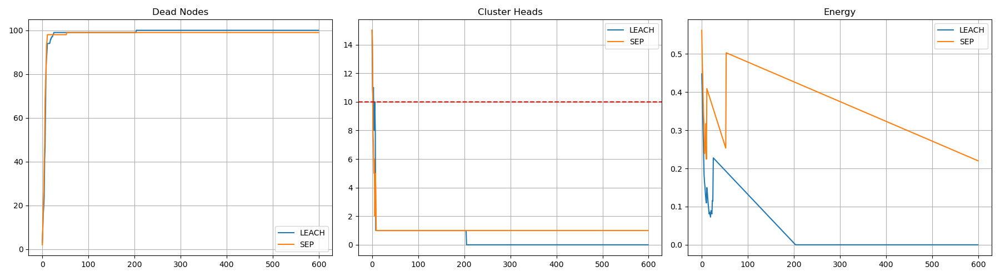
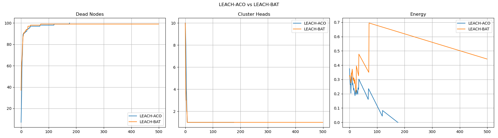
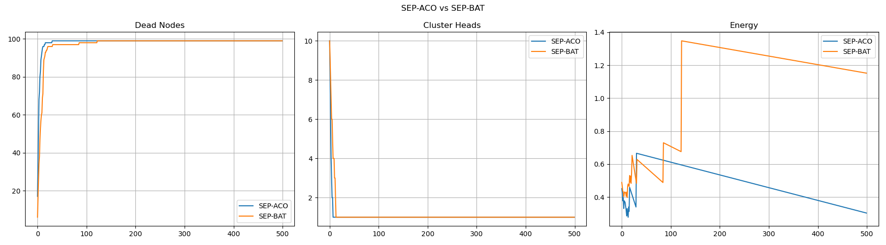

# 🐜 ACO-Based Optimization in Wireless Sensor Networks

## 📌 Overview

This project implements and compares different clustering and optimization techniques for Wireless Sensor Networks (WSN), including:

* LEACH (Low Energy Adaptive Clustering Hierarchy)
* SEP (Stable Election Protocol)
* ACO (Ant Colony Optimization)
* BAT Algorithm

The goal is to improve energy efficiency, extend network lifetime, and analyze performance differences between these approaches.

---

## 🎯 Objectives

* Optimize cluster head selection using ACO and BAT algorithms
* Compare LEACH and SEP protocols
* Analyze energy consumption and node lifetime
* Visualize performance through graphs

---

## ⚙️ Technologies Used

* Python
* Jupyter Notebook
* NumPy
* Matplotlib

---

## 🧠 Algorithms Used

* LEACH Protocol
* SEP Protocol
* Ant Colony Optimization (ACO)
* Bat Algorithm

---

## 📂 Project Structure

```
aco-optimization/
│
├── ACO.ipynb
├── README.md
├── requirements.txt
└── images/
    ├── leach_vs_sep_analysis.png
    ├── leach_aco_vs_bat.png
    ├── sep_aco_vs_bat.png
    ├── final_analysis.png
```

---

## ▶️ How to Run

1. Install dependencies:

```
pip install -r requirements.txt
```

2. Run the notebook:

```
jupyter notebook
```

3. Open:

```
ACO.ipynb
```

---

## 📊 Results

### 🔹 LEACH vs SEP



### 🔹 LEACH-ACO vs LEACH-BAT



### 🔹 SEP-ACO vs SEP-BAT



---

## 📈 Key Observations

* ACO improves cluster head selection efficiency
* BAT algorithm provides competitive performance
* SEP outperforms LEACH in network stability
* Energy consumption is optimized using swarm intelligence

---

## 🚀 Future Improvements

* Add real-time visualization
* Convert into web application (Flask/Streamlit)
* Implement hybrid optimization models
* Improve scalability for large networks

---

## 👨‍💻 Author

**Nisant Kumar Pradhan**

---

## ⭐ Note

This project is created for academic and learning purposes in optimization and wireless sensor networks.
